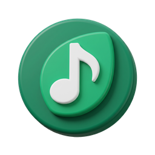

<div align="center">
  

  <h1>Life Music</h1>

  <p><b>Cliente de música para Android. Un desarrollo de CG LABS.</b></p>

  <p>
    
    
    
  </p>
</div>

---

> ### ⚠️ Proyecto educativo y sin ánimo de lucro
>
> Life Music **no es un producto comercial** y no se vende, ni lleva publicidad, ni
> acepta donaciones. Existe para aprender: para practicar arquitectura Android,
> procesamiento de audio y diseño de interfaz sobre una base real y compleja.
>
> No está afiliado a Google, a YouTube ni a ninguno de los proyectos de los que
> desciende. Lea el [aviso legal](#aviso-legal) antes de usarlo.

> **In English** — Life Music is a **non-commercial, educational** Android music
> client by CG LABS. It is a fork of [Echo Music](https://github.com/EchoMusicApp/Echo-Music),
> which itself descends from Vivi Music / Metrolist and InnerTune. Licensed under
> **GPL-3.0**, inherited from that lineage. It is not sold, carries no ads, and is
> not affiliated with Google or YouTube. See [Credits](#créditos-y-linaje).

---

## Qué es

Life Music es una **versión modificada de [Echo Music](https://github.com/EchoMusicApp/Echo-Music)**,
un cliente de terceros para YouTube Music. No se construyó desde cero: se partió
de un proyecto maduro para poder centrarse en lo que aporta valor —funciones
nuevas y decisiones de diseño propias— en lugar de reimplementar un reproductor.

Eso está dicho sin rodeos a propósito. La mayor parte del código que hace que
esto funcione lo escribieron otras personas, y sus nombres están más abajo.

## Lo que añade Life Music

### Life Line
Una sola línea de la letra bajo el artista, en la vista principal del
reproductor, **resaltada palabra por palabra** conforme se canta. Convive con la
carátula: no la reemplaza, que es lo que la distingue del panel de letras
completo.

El barrido se calcula en espacio de **caracteres**, no de palabras, para que el
degradado caiga donde está el texto y no donde estaría si todas las palabras
midieran igual. Cuando la línea no cabe, se desplaza manteniendo la palabra que
suena al 40 % del ancho visible.

### La voz de Life Line
Cuando no hay letra que cantar, **habla la app**. Y no con frases decorativas:
cada estado sale de una señal real del reproductor que ya existía y que no
miraba nadie.

| dice | porque |
|---|---|
| *Fundiendo las notas…* | hay un fundido cruzado en curso |
| *Enlazando con lo que viene* | la app encadenó la siguiente pista |
| *Se fue el internet* | esperando conexión |
| *Se va apagando…* | últimos segundos de la canción |
| *Esta se canta con el cuerpo* | ningún proveedor tiene letra |

### Modo karaoke
La letra a pantalla completa, palabra por palabra, con tres cosas que la separan
de «la vista de letra pero más grande»:

- **Se ve la línea siguiente.** Cantar es anticipar.
- **Cuenta atrás en los huecos.** Tres puntos marcan lo que falta para volver a
  entrar tras un pasaje instrumental.
- **La palabra que suena va en color de acento**, no solo resaltada.

Incluye una **reducción rápida de voz** por cancelación de centro en banda: se
descompone en medio y lados y solo se ataca el medio en la banda vocal,
conservando el bajo por debajo de 200 Hz y el aire por encima de 7,5 kHz. Es
resta, no separación, y la app lo dice en su propia pantalla en vez de prometer
lo que no da.

### Relevo de marca
El título de la pantalla de inicio se releva con el wordmark de CG LABS y vuelve,
con un fundido encadenado de casi dos segundos. La marca aparece sin ocupar
espacio propio en la barra.

### Correcciones sobre la base heredada
- La letra de la canción **se descargaba en el hilo principal**, congelando la
  interfaz en cada cambio de pista. Ahora va en `Dispatchers.IO`.
- El colector que traía la letra al cambiar de canción colgaba de una preferencia
  que **no escribía nadie**: llevaba muerto desde antes del fork.
- `google-services.json` apuntaba al **proyecto de Firebase de Echo**. Retirado:
  el fork no envía analítica ni fallos a infraestructura ajena.
- El auto-actualizador venía **activado por defecto** y ofrecía instalar el APK de
  Echo. Desactivado por defecto y redirigido; toda la identidad del repositorio
  vive ahora en un único fichero, `constants/Repo.kt`.

## Créditos y linaje

Life Music no existiría sin este trabajo previo. Todos los proyectos de la cadena
están bajo **GPL-3.0**:

```
InnerTune  (z-huang)
   └─ Metrolist / Vivi Music  (vivizzz007)
        └─ Echo Music  (EchoMusicApp)
             └─ Life Music  (CG LABS)
```

Echo Music acredita a su vez a **ArchiveTune**, **SimpMusic**, **Better Lyrics**,
**Music Recognizer** y **BravePipe**. Los avisos de copyright de terceros
presentes en el código —incluidos los de **Chartreux Westia** en los módulos de
Spotify— se conservan intactos, tal como exige la GPL-3.0 en sus secciones 4 y 5.

Los módulos que se llaman como su fuente (`echomusiccanvas`, `applecanvas`,
`kugou`, `lrclib`, `paxsenixlyrics`, `simpmusic`, `unison`) **conservan su
nombre**: identifican al servicio del que obtienen datos, no a esta app.

La pantalla **Acerca de** dentro de la aplicación repite estos créditos.

## Licencia

**GPL-3.0.** No es una elección: es una obligación heredada. El copyleft se
dispara al *distribuir*, no al *vender*, así que el carácter educativo y gratuito
del proyecto no exime de nada.

Eso significa que este repositorio es público, que el código fuente está
disponible, que los avisos de copyright de toda la cadena se conservan y que
cualquier trabajo derivado tiene que seguir siendo GPL-3.0.

El texto completo está en [LICENSE](LICENSE).

## Compilar

```bash
git clone https://github.com/cgus392-cmd/Life-Music.git
cd Life-Music
./gradlew assembleUniversalFossDebug
```

Requisitos: **JDK 21**, Android SDK 36, NDK 27.0.12077973.

El proyecto tiene **18 módulos Gradle** y dos dimensiones de sabor:

- **`foss`** (por defecto) / **`gms`** — sin o con servicios de Google.
- **`arm64`**, **`arm`**, **`x86`**, **`x64`**, **`universal`** — el APK universal
  incluye las cuatro ABI y pesa bastante más; para un dispositivo concreto,
  `arm64` es lo normal.

Añadir una función no obliga a tocar el núcleo: módulo nuevo →
`settings.gradle.kts` → `implementation(project(":x"))` → cablear con Hilt.

**Stack:** Kotlin 2.3.10 · Jetpack Compose · Material 3 · Media3/ExoPlayer 1.7.1 ·
Room 2.8.4 · Hilt 2.59.1 · Ktor 3.4.0 · minSdk 26 · targetSdk 36.

## Aviso legal

Life Music accede a contenido de YouTube Music mediante APIs no oficiales, lo que
**va en contra de sus términos de servicio**. Proyectos de esta misma familia han
recibido reclamaciones DMCA.

Se publica exclusivamente con fines **educativos y de investigación**. No se
distribuye contenido protegido: la aplicación es un cliente, y todo el material
pertenece a sus respectivos titulares. Quien lo use asume la responsabilidad de
hacerlo conforme a la legislación de su país.

Si usted representa a un titular de derechos y considera que este repositorio
infringe alguno, abra una incidencia y se atenderá.

---

<div align="center">
  <sub>Un desarrollo de <b>CG LABS</b> · © 2026</sub>
</div>
